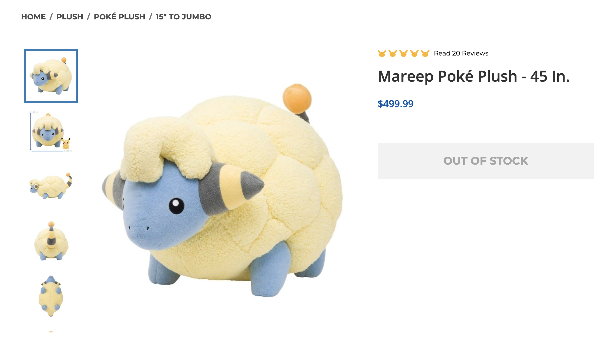

# Mareep-Hunting
I really want this $500 jumbo 45" Mareep plush from the Pokemon Center, but it has been out of 
stock since November 2021. 

## Description
This program searches for Mareep products sold by PokemonCenter.com twice a day, scheduled on my 
Raspberry Pi at 6am and 6pm CT. Every Sunday, I'll receive an email letting me know what my search 
results are so that I can monitor that my script is running as expected. If my beloved is finally 
back in stock, an email will be sent alerting me to buy it immediately.

The Pokemon Center website has pretty strict security measures to prevent bots from scraping its 
site, so I had to monitor its stock using a roundabout way. Google Shopping seems to accurately 
depict items in stock, so I used SerpAPI to search and return results. From those results, I 
collected the product listing titles and checked if they included "45" to match the plush that I 
want. Finally, I set up a SMTP server hosted by Gmail to send emails of the results to myself.